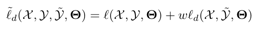
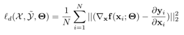
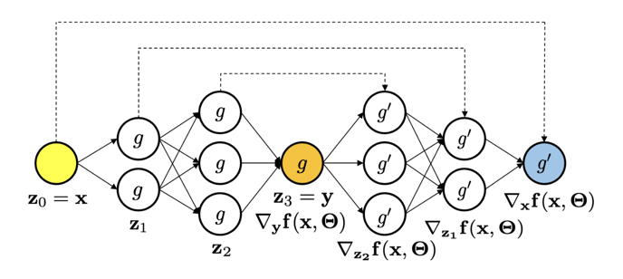
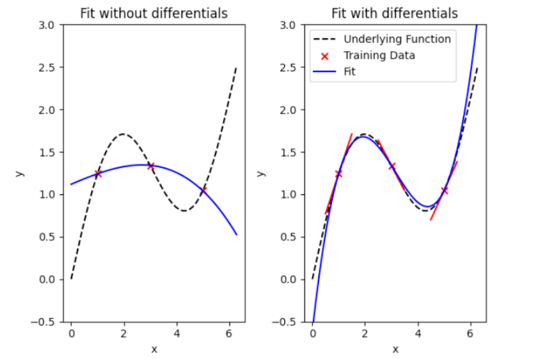

Tensorflow and Pytorch implementation of differential machine learning (https://arxiv.org/abs/2005.02347, by Brian Huge and Antoine Savine).

The implementation is still in progress.

## Differential Machine Learning

Differential Machine Learning is a bias-free regularization technique applied in small-data regimes where the differentials of the training data are readily available (or can be computed using automatic adjoint differentiation (AAD) at little cost). It is a generalization of classical regularization techniques that penalizes the prediction error in the differentials, proposing a regularizer

where 

penalizes the prediction error in the differentials of the training data, leveraging the fact that f (x,Θ) is not only differentiable with respect to the parameters, a property commonly used when training neural networks, but also with respect to the inputs x.

The use of Differential Machine Learning provides several advantages:

1. A loss function incorporating both predictions and differentials circumvents the bias-variance tradeoff incurred in classical regularization methods while preventing overfitting in a small-data regime.
2. The effective size of the dataset is much larger , with m training examples we have n x m differentials (n being the dimension of the inputs x(i) ). With AAD, we effectively simulate a much larger dataset for a minimal additional cost, especially in high-dimensional problems.
3. The neural network picks up the shape of the pricing function, learning from slopes as well as points, resulting in much more stable and potent learning, even with few examples.

## Implementation Architecture

An intuitive interpretation of how the architecture of differential machine learning works can be illustrated by augmenting the neural network by a so-called twin-network, corresponding to the computation of a prediction (approximation of the learned function) together with its differentials wrt. its inputs (approximation of the differentials).
The first half of the twin network is the original network, traversed with feedforward induction to predict a value. The second half is computed with the backpropagation equations to predict differentials. Both halves of the twin network depend on the same weights and biases, meaning that both halves can be backpropagated through in training. The twin network is illustrated in the figure below:

## Example

The black, dotted line shows the underlying function approximated by a neural network. From this function, a sample of three data points has been generated (shown in red). An approximation of the underlying function using these three points only is hard to generate, as shown in the visualization on the left-hand side - the neural network does not generalize well. 
By augmenting the training set with differential training data and applying the proposed regularization technique during training, a soft constraint is imposed to enforce the tangents of the neural network to match the tangents of the underlying function. This results in a much better approximation of the underlying function using the same number of training samples, as shown in the visualization on the right-hand side:

